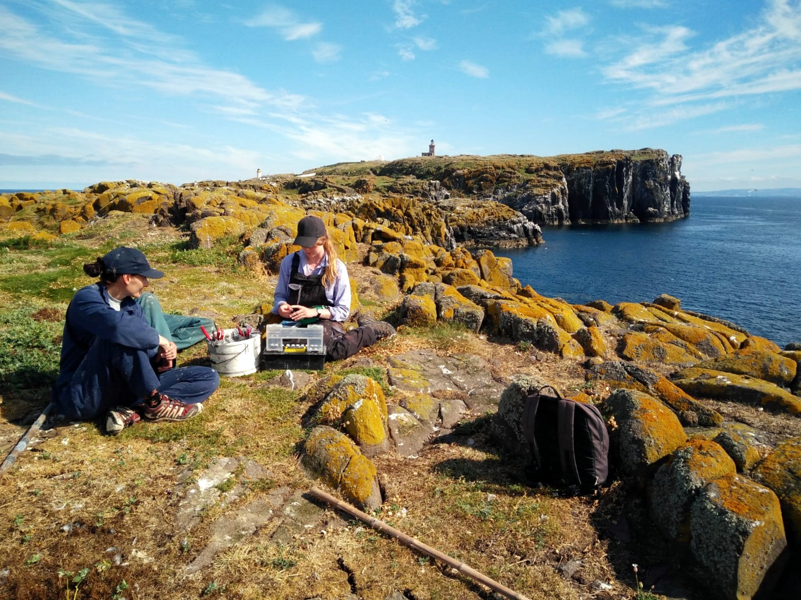
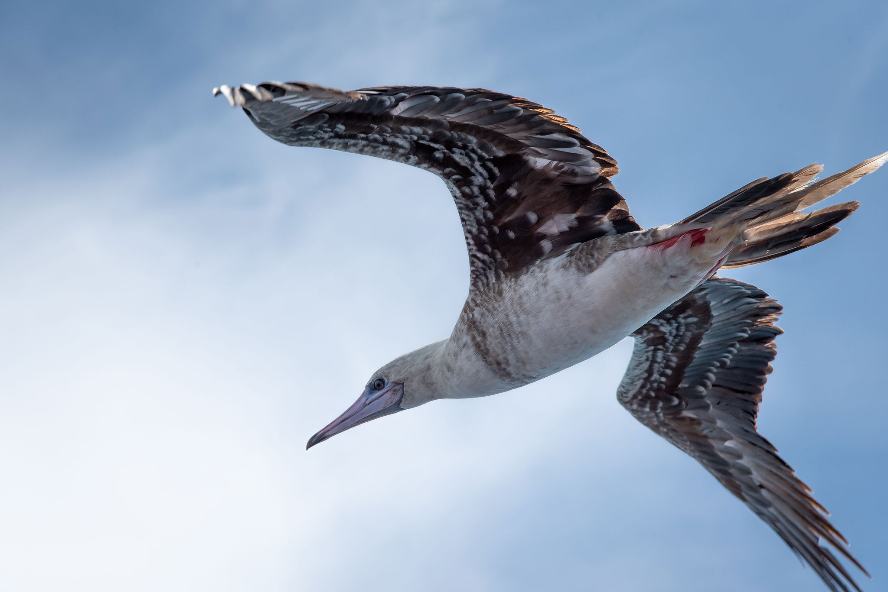
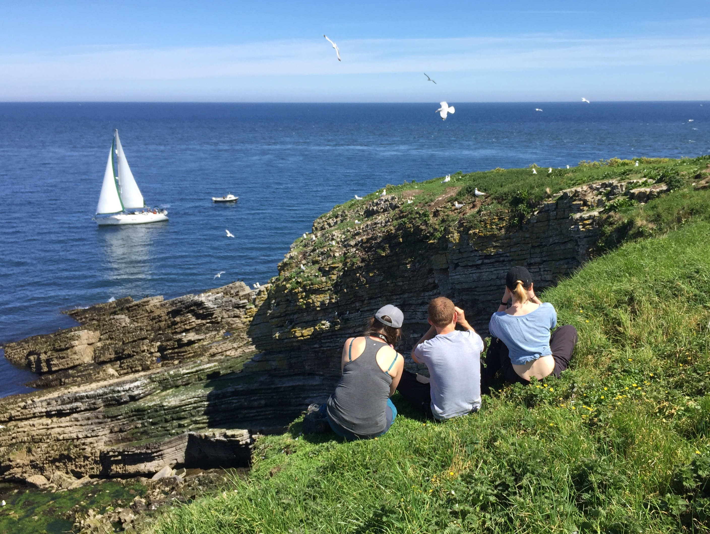
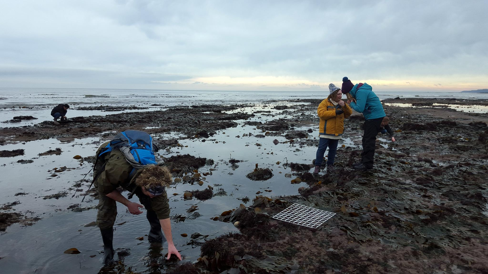

## Year-round temperate seabird behaviour

Using data collected from a variety of biologging devices, I investigate year-round patterns in seabird activity, movement and energetics. Recently I have been thinking about how these kinds of data might be used to inform offshore windfarm developments.

## Links between seabirds and coral reefs

I work with the [LEC-REEFS](https://lec-reefs.org/) team to investigate the influence of rat eradications and habitat restoration on tropical seabird populations. We are interested in the impacts of seabird-derived nutrients on coral reef ecology.

## Tropical seabird movement ecology

I work with Steve Votier, Alice Trevail, Robin Freeman and Malcolm Nicol as part of the Bertarelli Foundation's [Marine Science](https://www.marine.science/project/importance-of-the-british-indian-ocean-territory-for-seabirds/) programme. We are investigating the movement ecology and connectivity of tropical seabirds within the Indian Ocean.

## Estimating seabird energy expenditure

I have created a Shiny app, ‘[The Seabird FMR Calculator](https://ruthedunn.shinyapps.io/seabird_fmr_calculator/)’, to generate estimates of energy expenditure for any population of any species of breeding seabird. Alongside Jamie Duckworth and Jonathan Green, we have also written a '[Framework to Unlock Marine Bird Energetics](https://doi.org/10.1242/jeb.246754)'.

## The ecological importance of elasmobranchs

I worked alongside Mike Heithaus and Yannis Papastamatiou at Florida International University to investigate the ecological importance of sharks and their relatives across the world's marine ecosystems, with a focus on reef sharks and coral reef ecosystems.

## Citizen science within intertidal ecosystems

I am skilled in the identification of rocky shore organisms and previously worked on the Capturing Our Coast project. Together the CoCoast team trained almost 3,000 rocky shore citizen scientists to collect data on marine biodiversity around the coasts of the UK.

*View my publications [here](https://www.ruthedunn.com/publications).*
